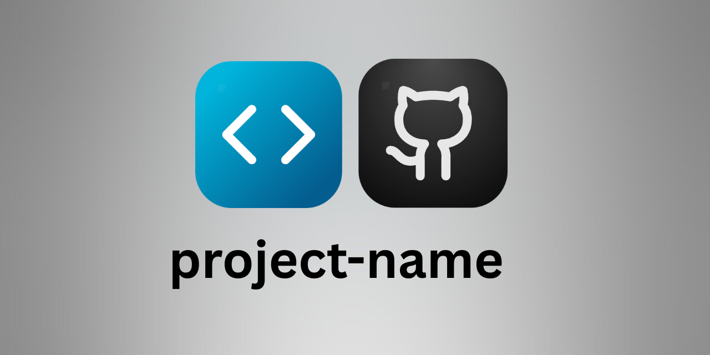

<div align="center">

<!-- ICONS: Create at https://vd7.dev/icon-creator, export to assets/icons/, run gen-social.sh -->


<h1 align="center">project-name</h1>
<p align="center"><i><b>One-liner description</b></i></p>

[![Github][github]][github-url]



</div>

<br/>

## ToC

<ol>
    <a href="#about">About</a><br/>
    <a href="#how-to-build">How to build</a><br/>
    <a href="#next-steps">Next steps</a><br/>
    <a href="#tools-used">Tools used</a><br/>
    <a href="#contact">Contact</a>
</ol>

<br/>

## About

<!-- Describe what this project does -->

<br/>

## How to build

```bash
git clone <REPO_URL>
cd <REPO_NAME>
```

<br/>

## Next steps

- [ ] TODO
- [ ] ...
- [ ] ...

<br/>

## Tools used

[![Example][example-badge]][example-url]

<br/>

## Contact

<a href="https://vd7.io"></a> &nbsp; <a href="https://x.com/vdutts7"></a>
 
<!-- BADGES - UPDATE THESE -->
[example-badge]: https://img.shields.io/badge/Example-000000?style=for-the-badge
[example-url]: https://example.com
[github]: https://img.shields.io/badge/PROJECT__NAME-000000?style=for-the-badge&logo=github&logoColor=white
[github-url]: https://github.com/GITHUB_USERNAME/PROJECT_NAME
