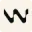
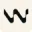
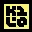

<div align="center">

<!-- ICONS: Create at https://vd7.dev/icon-creator, export to assets/icons/, run gen-social.sh -->


<h1 align="center">PROJECT_NAME</h1>
<p align="center"><i><b>One-liner description here.</b></i></p>

[![Github][github]][github-url]


</div>

<br/>

## Table of Contents

<ol>
    <a href="#about">About</a><br/>
    <a href="#how-to-build">How to build</a><br/>
    <a href="#next-steps">Next steps</a><br/>
    <a href="#tools-used">Tools used</a><br/>
    <a href="#contact">Contact</a>
</ol>

<br/>

## About

GitHub repo template with AI agent configs, git hooks, and automation scripts.

**Agent Configs**

| | Agent | Files |
|:---:|-------|-------|
|  | Cursor | `.cursor/rules/*.mdc`, `.cursorignore` |
|  | Claude | `CLAUDE.md` |
|  | Codex | `AGENTS.md` |
|  | Copilot | `.github/copilot-instructions.md` |
|  | Gemini | `GEMINI.md` |
|  | Aider | `.aider.conf.yml`, `CONVENTIONS.md` |
|  | Windsurf | `.windsurfrules` |
|  | Zed | `.rules` |
|  | Roo | `.roomodes` |
|  | Codeium | `.codeiumignore` |
|  | Amazon Q | `.amazonq/rules/*.md` |
|  | Kiro | `.kiro/steering/product.md`, `.kiro/steering/tech.md` |
|  | OpenCode | `opencode.json` |
|  | Kilo | `.kilocode/launchConfig.json` |
|  | Traycer | `.traycer/` |
|  | Amp | `AMP.md` |
|  | Qodo | `.ai_config.toml` |
|  | Warp | `warp.md` |
|  | Droid | `.droid.yaml` |
|  | Cline | `.clinerules/*.md` |
|  | Trae | `.trae/project_rules.md`, `.trae/user_rules.md` |
|  | Antigravity | `.antigravity` |
|  | Pear AI | `~/.pearai/config.json` |
|  | Conductor | `conductor.json` |
|  | Kimi CLI | `AGENTS.md` |
|  | Qwen CLI | `.env`, `.qwen-ignore` |

--

- **Git Hooks** - `pre-commit`, `pre-push`, `post-checkout`

--

- **Scripts** - `setup.sh`, `gen-social.sh`, `upload-cloudinary.sh`, `health-check.sh`

--

## How to build

```bash
git clone <REPO_URL>
cd <REPO_NAME>
```

--

## Next steps

- [ ] TODO

--

## Tools used

[![Example][example-badge]][example-url]

--

## Contact

[![Website][website]][website-url]
[![Twitter][twitter]][twitter-url]

--

<!-- BADGES - UPDATE THESE -->
[example-badge]: https://img.shields.io/badge/Example-000000?style=for-the-badge
[example-url]: https://example.com
[github]: https://img.shields.io/badge/💻_PROJECT__NAME-000000?style=for-the-badge
[github-url]: https://github.com/GITHUB_USERNAME/PROJECT_NAME
[website]: https://img.shields.io/badge/vd7.io-000000?style=for-the-badge&logo=Safari&logoColor=white
[website-url]: https://vd7.io
[twitter]: https://img.shields.io/badge//vdutts7-000000?style=for-the-badge&logo=X&logoColor=white
[twitter-url]: https://x.com/vdutts7
